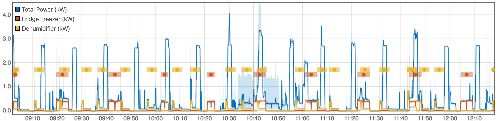

# NILM Synth
### Generate Synthetic Datasets for training Non-Intrusive Load Monitoring Algorithms



## Installation
```bash
$>python3 setup.py install
```
This software requires joule (https://github.com/wattsworth/joule) and access to a Joule server.
## Usage
Build library web documentation:

```bash
$~/nilm_synth> python3 build_docs.py
```

For load library data sets email donnal-at-usna-dot-edu

To extract exemplars from existing labeled datasets follow 
the YAML configuration guid in `docs/exemplar_syntax.yml` then
run 
```bash
$> exemplar-extract --config exemplars.yml
```

To create a new dataset specify the load configuration following
the YAML configuration guide in `docs/load_syntax.yml`. Then run
```bash
$> nilm-synth --config load_spec.yml
```

Output data can be loaded with pandas and processed with 
the NILMTK framework (http://nilmtk.github.io/). 
